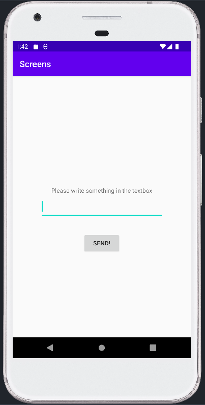

# Rapport

Efter att jag forkade och klonade projektet från github skapade jag en till activity vid namn
"SecondActivity" där den ska ta emot data från "MainActivity" och visa upp. 

```xml
...
<application
        android:allowBackup="true"
        android:icon="@mipmap/ic_launcher"
        android:label="@string/app_name"
        android:roundIcon="@mipmap/ic_launcher_round"
        android:supportsRtl="true"
        android:theme="@style/AppTheme">
        <activity
            android:name=".SecondActivity"
            android:exported="true" />
        <activity android:name=".MainActivity"
            android:exported="true">
            <intent-filter>
                <action android:name="android.intent.action.MAIN" />

                <category android:name="android.intent.category.LAUNCHER" />
            </intent-filter>
        </activity>
    </application>
...
```
Sedan efter det började jag arbeta på startsidans layout, där jag lade till en editTextView och en button. Dessa
widgets är programmerade att mata in data från editTextView med putExtra och sedan skickar den vidare
till SecondActivity när man trycker på knappen där den visas upp i en textView på sidan. TextView
i SecondActivity heter textView2 och hämtar datan från extra genom getExtra-kommandot. Till sist 
lade jag till en textview i MainActivity som ger en enkel instruktion att skriva något i textrutan.

```xml
... // activity_main.xml
<Button
    android:id="@+id/button"
    android:layout_width="wrap_content"
    android:layout_height="wrap_content"
    android:layout_marginTop="32dp"
    android:text="Send!"
    app:layout_constraintEnd_toEndOf="parent"
    app:layout_constraintStart_toStartOf="parent"
    app:layout_constraintTop_toBottomOf="@+id/editText" />

<EditText
    android:id="@+id/editText"
    android:layout_width="285dp"
    android:layout_height="56dp"
    android:autofillHints=""
    android:ems="10"
    android:inputType="textPersonName"
    android:text=""
    app:layout_constraintBottom_toBottomOf="parent"
    app:layout_constraintEnd_toEndOf="parent"
    app:layout_constraintStart_toStartOf="parent"
    app:layout_constraintTop_toTopOf="parent"
    tools:ignore="LabelFor" />

<TextView
    android:id="@+id/textViewInstruction"
    android:layout_width="wrap_content"
    android:layout_height="wrap_content"
    android:text="Please write something in the textbox"
    app:layout_constraintBottom_toTopOf="@+id/editText"
    app:layout_constraintEnd_toEndOf="parent"
    app:layout_constraintStart_toStartOf="parent" />
```
```java
... // MainActivity.java
    public class MainActivity extends AppCompatActivity {

    @Override
    protected void onCreate(Bundle savedInstanceState) {
    super.onCreate(savedInstanceState);
    setContentView(R.layout.activity_main);

    Button button1 = findViewById(R.id.button);
    button1.setOnClickListener(new View.OnClickListener() {
    @Override
    public void onClick(View view) {
    EditText editTxt = findViewById(R.id.editText);

    Intent screenIntent = new Intent(MainActivity.this, SecondActivity.class);
    screenIntent.putExtra("input", editTxt.getText().toString()); // Optional
    startActivity(screenIntent);
    }
    });
    }
    }
...
```
```xml
... // activity_second.xml
<TextView
    android:id="@+id/textView2"
    android:layout_width="96dp"
    android:layout_height="53dp"
    android:text=""
    app:layout_constraintBottom_toBottomOf="parent"
    app:layout_constraintEnd_toEndOf="parent"
    app:layout_constraintStart_toStartOf="parent"
    app:layout_constraintTop_toTopOf="parent" />
...
```
```java
... // SecondActivity.java
public class SecondActivity extends AppCompatActivity {

    @Override
    protected void onCreate(Bundle savedInstanceState) {
        super.onCreate(savedInstanceState);
        setContentView(R.layout.activity_second);

        Bundle dataInput = getIntent().getExtras();
        if (dataInput != null) {
            String data = dataInput.getString("input");
            TextView output = findViewById(R.id.textView2);
            output.setText(data);
        }
    }
}
```

